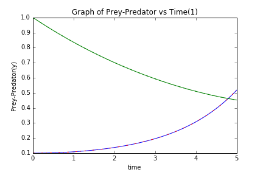
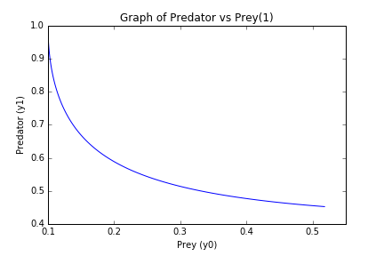
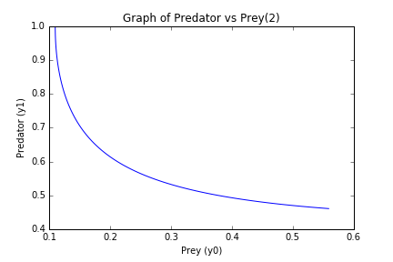

UECM3033 Assignment #3 Report
========================================================

- Prepared by: ** Lee Kah Woh **
- Tutorial Group: T2

--------------------------------------------------------

## Task 1 --  Gauss-Legendre formula

The reports, codes and supporting documents are to be uploaded to Github at: 

[https://github.com/LeeKahWoh/UECM3033_assign3)

Explain how you implement your `task1.py` here.
Explain how you get the weights and nodes used in the Gauss-Legendre quadrature.

Firstly, the weights and nodes used in the Gauss-Legendre quadrature can be obtained by numpy.polynomial.legendre.leggauss.
It will return and store the weights and nodes in 2 different arrays.
After that, 2 cases are considered.
The first one is the integration lies on the interval [-1,1] while another one is that it lies on all other intervals except on [-1,1].
We can straight apply the Gaussian Legendre N-point formula if it is the first case.
That is, the summation of y[i]*f(x[i]), where y[i] is the i-th weights and x[i] is the i-th nodes.
If the interval is not on [-1,1], or we say it is on [a,b], then apply a simple linear transformation on x.
That is, x'=(a+b)/2 + (b-a)(x/2). This transformation will change the interval [a,b] to [-1,1].
Lastly, we can apply the Gaussian Legendre N-point formula again.
The procedure is same as above, just to change the f(x[i]) to f((a+b)/2 + (b-a)(x[i]/2)).

---------------------------------------------------------

## Task 2 -- Predator-prey model

Explain how you implement your `task2.py` here, especially how to use `odeint`.

1	Firstly, import numpy, scipy and matplotlib.pyplot as np,sp and plt respectively.
2	Next, construct a self-defined function named dY_dt which will assign the upper limit,b and lower limit,a for the integral and return the differential equations of prey and predator in the form of array.
3	Then, set the initial condition to y0 and y1 as 0.1 and 1.0 in the array form of Y.
4	By using np.linspace, create 100 intervals between t=0 and t=5.
5	After that, use function integrate.odeint in scipy to integrate the system of ordinary differential equations with input dY_dt,array Y and t.
6	The function integrate.odeint will solve the ODE system using lsoda from the FORTRAN library odepack and solve the initial value problem for stiff or non-stiff systems of first order odes.
7	Moreover, the graph of y0 and y1 against time is plotted by using the functions in matplotlib.pyplot.
	The red line in the graph represents prey while the green line in the graph represents predator.
	The graph is saved as Graph of y1 and y0 vs time 1.png.
8	At the moment, another Graph of y1 vs y0 1.png is plotted and saved.

In order to test sensitivity,set another initial condition with y0=0.11 and y1=1.0 in the array form as Y2.
Then repeat the steps 4 to 8
The two graphs are saved as Graph of y1 and y0 vs time 2.png and Graph of y1 vs y0 2.png respectively.

Put your graphs here and explain.

     

As shown of the graph above, the population or number of prey (y0) is the lowest while the number of predators (y1) is the highest at the beginning.
The number of predators was declined due to no food(prey), so the preys are able to increase their population.
As the time flows, the population or number of preys will increases over time as the number of predators is decreasing.
The predators is very little when there are plenty of preys but outstrip their food supply and decline.
When the predator population is lower, then the prey population will increase.
This will continue in a cycle of growth and decline.

Is the system of ODE sensitive to initial condition? Explain.

     

I think the system of ODE are not so sensitive to initial condition because there is only a bit of difference between both of the Graphs of Predator vs Prey.

-----------------------------------

last modified: 17 April 2016
